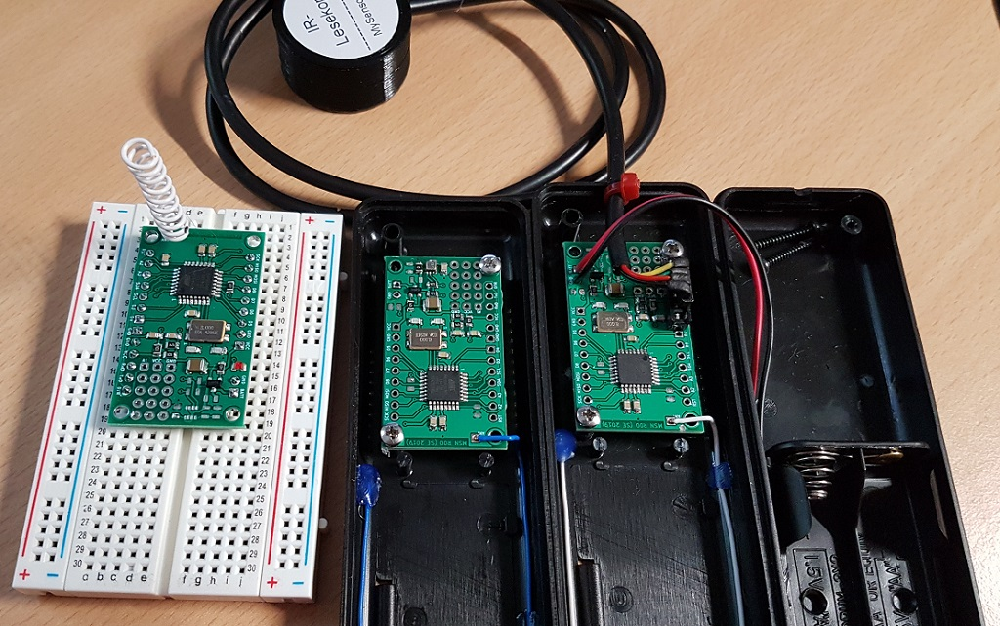

# MSN

## MySensors Nodes
Hardware and software for MySensors.org IOT network.

The MSN PCB can be used for different node types. The minimal assembly consists of a Mega328P microcontroller (as seen on many Arduinos), a RFM69CW rf module with 868 or 433 MHz and some little stuff for reverse protection and battery monitoring.

With different assembly options, this PCB can be used for:
  * Temperature, humidity and pressure measurements (With BME280 assembled)
  * Sensor above with additional light level (with extra BH1750 on the proto field)
  * Cheap temperature measurement (With DS18B20 assembled on the small proto field)
  * IR-reader for digital Power meter (with external IR Head connected to UART)
  * Prototyping on Breadboards with soldered pin header

The PCB features also
  * ISP pins are connected to the pin header for flashing the bootloader
  * Arduino pro mini compatible pin header for connecting a UART-board
  * Optional LED for example for active transmission
  * Mounting holes for fitting in the “Strapubox 6090” case
  * A snap off proto board, which fit under or on top of the MSN PCB.

## V0.1
Software tested on breadboards. Hardware not tested, because the boards are still in production.

## V1.0
TBD Software modified to run on MSN PCB. Different improvements, like other libraries for enable power savings of the sensors.
